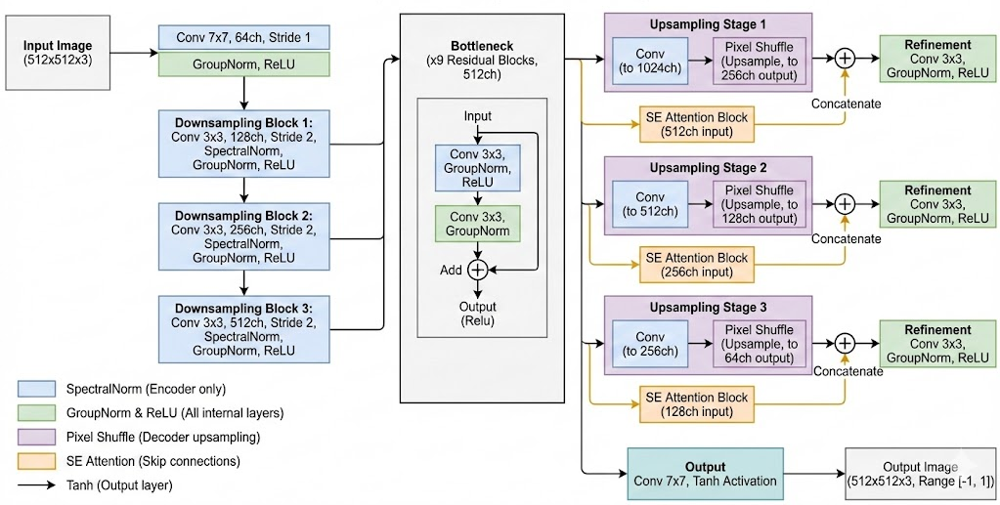
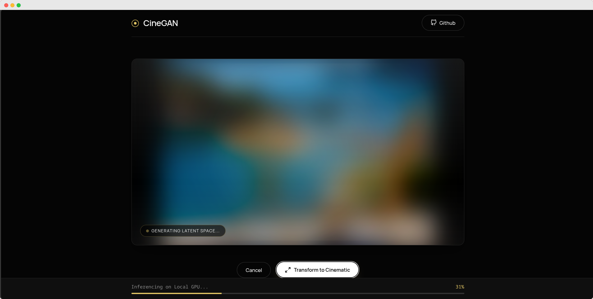

# 🎬 CineGAN

CineGAN uses a **Pix2Pix-based Generative Adversarial Network (GAN)** to perform style transfer. It takes your original photos and reimagines them with negative cinematic color grading and tone.


## Model Architecture 
This model is a generator designed for image to image translation tasks at a native resolution of 512×512. It follows an encoder bottleneck decoder structure with attention enhanced skip connections. The model was trained fully on TPU available on Kaggle. Training code [Here](https://github.com/AntareepDey/CineGAN/blob/main/CineGAN-TPU.ipynb). Dataset used for training is [Here](https://www.kaggle.com/datasets/xuhangc/filmset)




## 🚀 Setup with UV

This project uses [uv](https://github.com/astral-sh/uv) for blazing fast Python package management.

### 1. Install uv
If you haven't already, install `uv`:

```bash
# On macOS and Linux
curl -LsSf https://astral.sh/uv/install.sh | sh

# On Windows
powershell -c "irm https://astral.sh/uv/install.ps1 | iex"
```

### 2. Clone & Sync
Clone the repository and install dependencies:

```bash
git clone https://github.com/yourusername/CineGAN.git
cd CineGAN

# Create virtual environment and install dependencies
uv sync
```


## 💻 CLI Usage

You can process images directly from your terminal using `CineGAN.py`.

### Basic Command
```bash
uv run CineGAN.py path/to/your/image.jpg
```

### Options & Arguments

| Argument | Description | Default |
|----------|-------------|---------|
| `input` | Path to the input image (Required) | - |
| `output` | Path to the output image (Optional) | Auto-generated |
| `--size` | Internal processing resolution | `512` |
| `--model` | Path to the generator model file | `./models/generator.keras` |
| `--upscale` | Upscale factor (e.g., `2` for 2x) | `1.0` |
| `--cuda` | Force usage of CUDA GPU | `False` |
| `--quiet`, `-q` | Suppress logs and animations | `False` |

### Examples

**Upscale an image by 2x:**
```bash
uv run CineGAN.py input.jpg --upscale 2
```

**Process with CUDA acceleration:**
```bash
uv run CineGAN.py input.jpg --cuda
```

**Batch process all images in a folder:**
```bash
for img in photos/*.jpg; do
    uv run CineGAN.py "$img" --quiet
done
```


## 🌐 Web Server

CineGAN includes a Flask-based web interface for easy interaction.

### Start the Server
Run the following command to start the local web server:

```bash
uv run server.py
```

Once running, open your browser and navigate to:
👉 **http://localhost:5000**

### Server Options

| Option | Description | Default |
|--------|-------------|---------|
| `--port` | Port to run the server on | `5000` |
| `--cuda` | Enable CUDA GPU acceleration | `False` |
| `--model` | Path to custom model file | `./models/generator.keras` |

**Example: Run on port 8080 with GPU:**
```bash
uv run server.py --port 8080 --cuda
```

It should look like the following:




